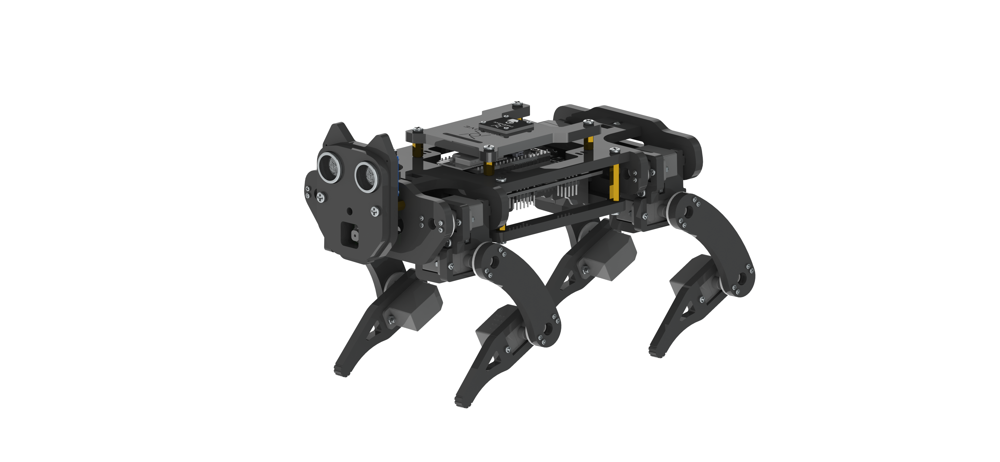
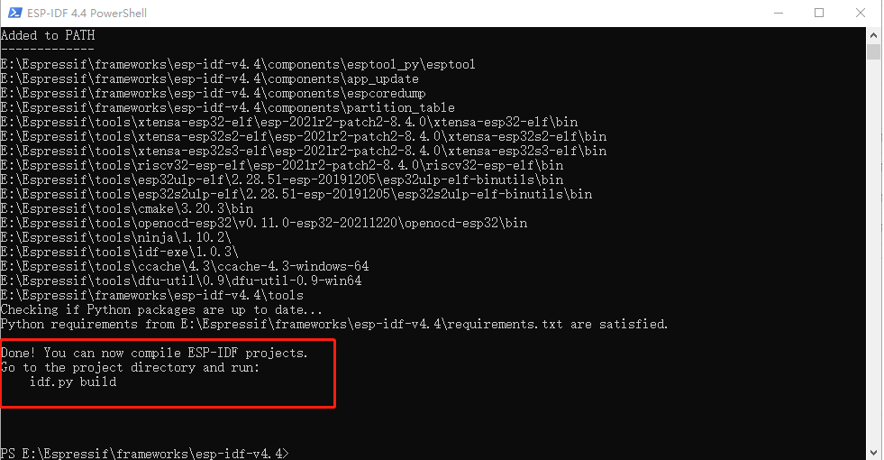
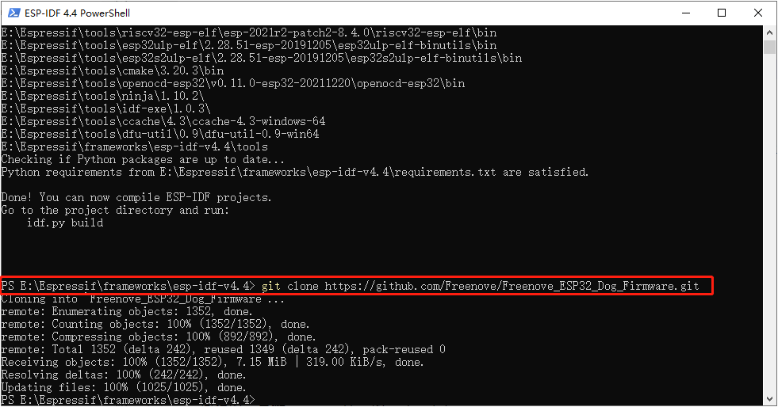
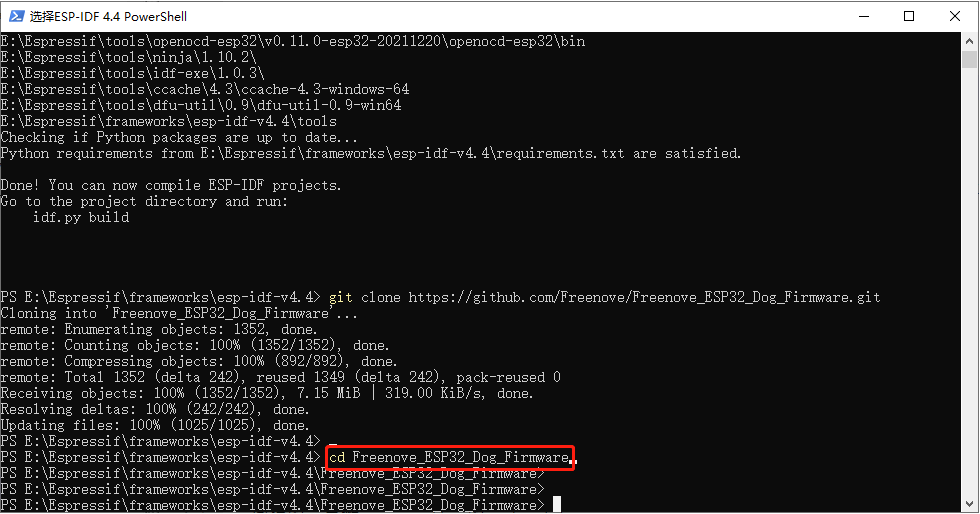
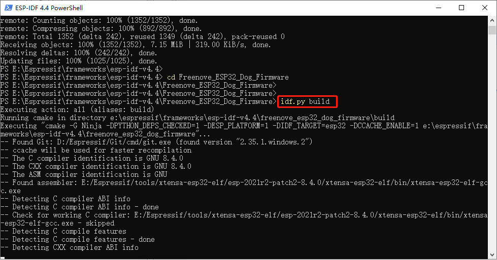
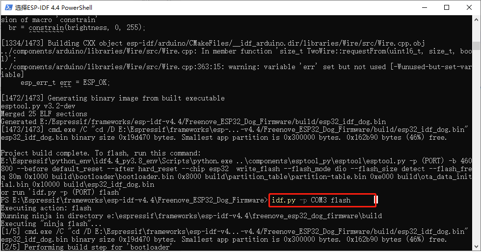
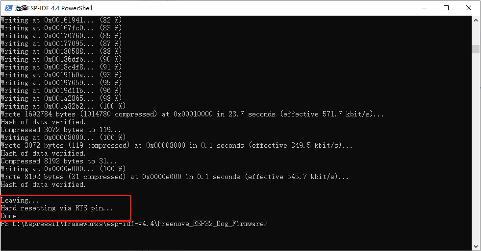

# Freenove_ESP32_Dog_Firmware
Firmware codes for Freenove product FNK0062.

> A Robot Dog Kit for ESP32.

## Description
This is the source code for Freenove_Robot_Dog_Kit_for_ESP32.

For details about how to assemble and use Freenove_Robot_Dog_Kit_for_ESP32, see the following URL.

URL: [https://github.com/Freenove/Freenove_Robot_Dog_Kit_for_ESP32](https://github.com/Freenove/Freenove_Robot_Dog_Kit_for_ESP32)

### Download

* **Use command in console**

	Run following command to download all the files in this repository.

	`git clone https://github.com/Freenove/Freenove_ESP32_Dog_Firmware.git`

* **Manually download in browser**

	Click the green "Clone or download" button, then click "Download ZIP" button in the pop-up window.
	Do NOT click the "Open in Desktop" button, it will lead you to install Github software.

> If you meet any difficulties, please contact our support team for help.

## Usage
### Step 1. Install ESP-IDF.

Please refer to the official ESP-IDF programming guide to install a compilation environment suitable for your computer platform.  
URL: [https://docs.espressif.com/projects/esp-idf/en/v4.2.3/esp32/get-started/index.html](https://docs.espressif.com/projects/esp-idf/en/v4.2.3/esp32/get-started/index.html)

### Step 2. Compile and download the project.
1, Set up the environment variables.

You can see the tip: 
> idf.py build

2, Download the code file.

>`git clone https://github.com/Freenove/Freenove_ESP32_Dog_Firmware.git`

3, Go to the code file directory

>`cd Freenove_ESP32_Dog_Firmware`

2, Compile.

>`idf.py build`

3, Upload the bin to your Dog.

Different computer systems may have different download commands.  

Make sure you have ESP32 connected to your computer and that your computer has the CH340 driver installed.  

Windows: `idf.py -p COMx flash`

MAC OS: `idf.py -p /dev/cu.usbserial-xxxxx flash`

Ubuntu: `idf.py -p /dev/ttyUSB0 flash`

4, Finish

## Support

Freenove provides free and quick customer support. Including but not limited to:

* Quality problems of products
* Using Problems of products
* Questions of learning and creation
* Opinions and suggestions
* Ideas and thoughts

Please send an email to:

[support@freenove.com](mailto:support@freenove.com)

We will reply to you within one working day.

## Purchase

Please visit the following page to purchase our products:

http://store.freenove.com

Business customers please contact us through the following email address:

[sale@freenove.com](mailto:sale@freenove.com)

## Copyright

All the files in this repository are released under [Creative Commons Attribution-NonCommercial-ShareAlike 3.0 Unported License](http://creativecommons.org/licenses/by-nc-sa/3.0/).

This means you can use them on your own derived works, in part or completely. But NOT for the purpose of commercial use.
You can find a copy of the license in this repository.

Freenove brand and logo are copyright of Freenove Creative Technology Co., Ltd. Can't be used without formal permission.

## About

Freenove is an open-source electronics platform.

Freenove is committed to helping customer quickly realize the creative idea and product prototypes, making it easy to get started for enthusiasts of programing and electronics and launching innovative open source products.

Our services include:

* Robot kits
* Learning kits for Arduino, Raspberry Pi, ESP32, and micro:bit
* Electronic components and modules, tools
* Product customization service

Our code and circuit are open source. You can obtain the details and the latest information through visiting the following web site:

http://www.freenove.com
